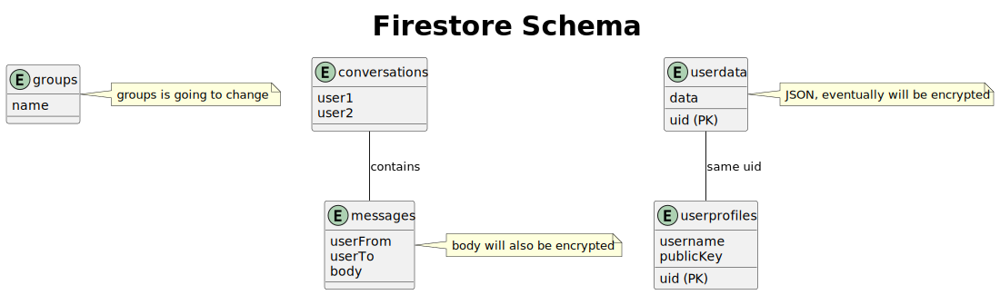

# Jetpack Compose (UI)

In Jetpack Compose, each component of the UI is a "composable" function. Oftentimes, we have to access the same object from most pages and components, so rather than passing that object through each component's children, we make them global singletons, accessable from anywhere.

For pages or other heavy components, we use a props system, where we pass in props using an instance of a class, like "HomeProps", which simplifies composable function declaration, modification, and especially helps when we must pass the same props to every child of a component.

All pages use Quark's custom navigation system. The navigation system uses URLs to navigate to different pages, and passes data in through URL arguments. The navigation controller must be passed into pages with props.

# Testing

As an Android application, there are two kinds of tests that must be run in development. First, we have generic developer-side testing, that can be run on any hardware. This kind of testing is used when we aren't relying on Android functionality, like performing regex on Strings.

The other kind of testing are device tests. These kind of tests rely on Android's APIs or device functionality in some way, so they cannot be run on any hardware, and must be run on a live Android phone or emulator. 

Firebase allows for security rules and collections testing on device, to ensure that the schema and rules work before pushing them to firebase.

# Authentication

We use a singleton for our authentication as well. We currently only allow for email/password authentication through Firebase. So, the singleton accepts an email and password, which comes from input in the UI, and either signs the user up, or authenticates their connection.

# Firestore

In Firestore, we have groups, conversations, userdata and userprofiles as our main collections. Each conversation has a subcollection of messages, which holds each individual message as a document.

# Local Storage

In addition to Firestore, we must store some information locally on the Android device. Specifically, we will eventually have to store the user's private key on device in a form of Android local storage. There may also be an amount of configuration stored locally.